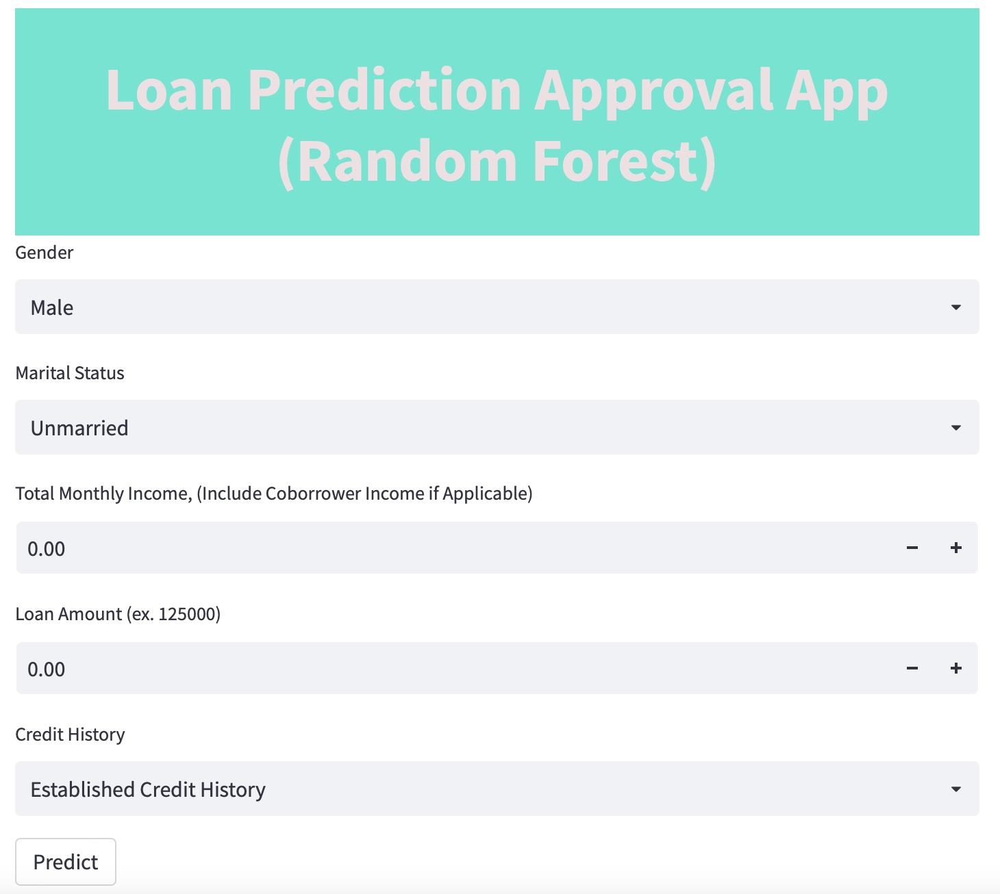
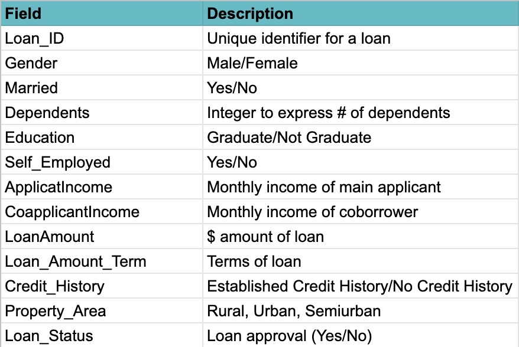

## Loan Approval Prediction - Random Forest Model and Deployed Web App

## Project Purpose: 
To demonstrate a full ML project from scratch to deployment to a web app.

## Business Case: 
To create a model that accurately predicts loan approval and automates the manual approval process. 

## Goal: 
To accurately predict loan approvals without falsely approving too many loans that should be denied (minimize False Positives). 

## Deliverable: 
A web app that end users can utilize to predict loan approvals using a Random Forest model on the backend. 

    1. Web App: https://jessramos2-loan-approval-random-forest-web-streamlit-app-47jl27.streamlitapp.com/
    
  

### In Repository:

1. Data & data dictionary

2. Random Forest Model Creation (Loan Approval Model.ipynb)

3. Sample decision tree from random forest
    
 

4. Web App Python Code (streamlit_app.py)

5. Web app link and screenshot

## Results and Model Evaluation: 

From a business perspective, we want to avoid predicting a positve loan approval when it was actually denied (False Positives), so ***Precision*** will be our best measures for the model. This will ensure that we are accurately predicting loan approvals and that predicted approvals are actual approvals (precision). 

Since this model produces very similar precision scores on both the training and testing data, it appears to be the best fit to maximize predictive power on the training dataset without overfitting and sacrificing predictability on the testing data. 

**Precision:** 
Precision on the testing data is ~78%, which means that we don't have a large amount of False Positives. This is great, because as a business, we want to avoid predicting loans approvals that will have to be denied later. 

**Accuracy:**
Accuracy on the testing data is ~80% which means that the model correctly predicts 4/5 of the loans. 

**Recall:**
 Recall on the testing data is 100% which means that the model accurately predicts all True Positives. This means that we will not miss out on any potential loan approvals (and revenue). 

**F1 Score:**
The F1 score on the testing data is ~88%, which is great since it takes into account both False Positives and False Negatives. 

## Business Impact: 

End users will be able to use the web app built off of this model to predict loan approvals right in front of the borrower. There will be no missed revenue opportunities since the model captures all true approvals (recall is 100%), and only a small portion of borrowers predicted to be approved will actually be denied. This will speed up the manual approval process and allow the company to process more loans in less time, resulting in more clients and revenue. 

### Next Steps: Monitor performance and retrain model with more data as more data becomes available. 
